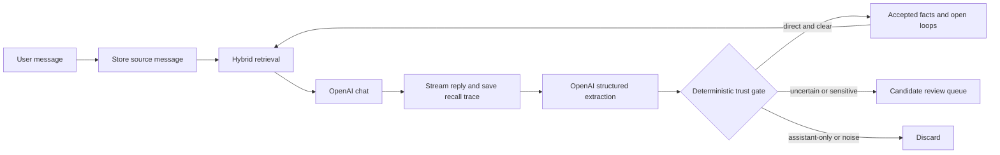

# Zeus

**A local personal agent with memory you can inspect, correct, and trust.**

Zeus remembers durable facts about one person: you. It keeps current facts, preserves
what used to be true, links every accepted memory to its source, and holds uncertain
claims for review instead of quietly turning them into truth.

The application and SQLite store run on your machine. Chat and memory extraction use
the OpenAI Responses API; local search continues to work without an API key.

## Why Zeus

Most assistant memory fails in one of two ways: old facts linger after life changes, or
the assistant starts treating an inference as something the user actually said. Zeus is
designed around preventing both failures.

- **Temporal truth.** Facts have validity windows. A new employer can close the old
  employer without erasing it, so both “Where do I work?” and “Where did I work before?”
  remain answerable.
- **Source-level provenance.** Every new fact points to the stored user message that
  produced it. Later reassertions and corrections are recorded as additional evidence.
- **A review boundary.** Direct, clear statements can be accepted automatically.
  Inference, ambiguity, sensitive material, and unexplained conflicts go to a candidate
  queue for explicit acceptance or rejection.
- **Honest recall.** Retrieval combines full-text search, local embeddings, and entity
  relationships. Calibrated semantic floors allow an unrelated question to return no
  result instead of the least-wrong memory.
- **User control.** Facts can be corrected, closed, revived, or forgotten. Entities can
  be merged, source conversations can be deleted, and the complete store can be exported
  as readable Markdown.

## What it includes

- A streaming chat interface that shows what each turn recalled and learned.
- A memory browser with current facts, historical facts, confidence, evidence, and
  source links.
- Entity dossiers for people, projects, organizations, places, topics, and things.
- A timeline of what Zeus learned and when.
- A review queue for proposed memories that were not safe to accept automatically.
- Structured goals and commitments with append-only event histories and restrained
  follow-up nudges.
- Source transcripts and per-response recall traces for investigating why Zeus answered
  a particular way.
- A stdio MCP server so other local agents can use the same memory.

## How a turn works



The model proposes memories; deterministic application code decides whether they are
accepted, held, or discarded. Assistant messages may provide conversational context to
the extraction pass, but they are never evidence for a memory.

## Quick start

Requirements:

- Node.js 22 or newer
- npm
- An OpenAI API key for chat and extraction

From the repository root:

```bash
npm install
cp .env.example .env.local
# Add OPENAI_API_KEY to .env.local
npm run dev
```

Open [http://127.0.0.1:3000](http://127.0.0.1:3000). The server binds to loopback only.

Without `OPENAI_API_KEY`, the memory browser, curation UI, export, tests, and lexical
search still work. Only chat, explicit MCP remembering, and model-backed extraction are
unavailable.

The first semantic search may download `Xenova/bge-small-en-v1.5` into `.models/`. The
model runs locally. Set `ZEUS_EMBEDDINGS=off` to skip it and use full-text plus graph
retrieval only.

## Configuration

| Variable | Required | Default | Purpose |
| --- | --- | --- | --- |
| `OPENAI_API_KEY` | For chat/extraction | — | OpenAI API credential |
| `OPENAI_MODEL` | No | `gpt-5.5` | Model used for both chat and extraction |
| `ZEUS_DB` | No | `~/.zeus/zeus.db` | SQLite database path |
| `ZEUS_EMBEDDINGS` | No | enabled | Set to `off` for FTS5 and graph search only |
| `ZEUS_MODEL_CACHE` | No | `.models` | Local embedding-model cache |
| `ZEUS_SEMANTIC_FLOOR` | No | `0.5` | Minimum fact-vector similarity |
| `ZEUS_EPISODE_SEMANTIC_FLOOR` | No | `0.52` | Minimum user-message similarity |

The semantic floors are model-specific safety thresholds, not general tuning knobs.
Re-measure them before changing the embedding model or lowering either value.

## Using Zeus

Chat normally. After each response, the receipt beneath the answer shows how many memory
items were recalled, accepted, held for review, or superseded.

The main views are:

- **Chat** — converse with Zeus and inspect the memory receipt for each turn.
- **Memory** — search and curate accepted facts or review pending candidates.
- **Open loops** — update goals and commitments, inspect their histories, and snooze
  commitment nudges.
- **Timeline** — see current and superseded facts in learned-at order.
- **Sources** — inspect or delete stored conversations and their dependent memory.

Deleting a source conversation also removes facts, candidates, goals, and commitments
supported only by that conversation. A fact with independent evidence survives and is
relinked to a remaining source.

## MCP integration

Zeus exposes the same database through a stdio MCP server. A generic client
configuration looks like this:

```json
{
  "mcpServers": {
    "zeus": {
      "command": "npx",
      "args": ["tsx", "src/mcp/server.ts"],
      "cwd": "/absolute/path/to/zeus"
    }
  }
}
```

Use the same `ZEUS_DB` and `OPENAI_API_KEY` environment in the MCP client if you override
either value. The repository’s `.mcp.json` is a local example; update its absolute `cwd`
when the checkout moves.

The server provides:

- `zeus_recall` — retrieve relevant accepted memory.
- `zeus_remember` — extract durable memory from an explicit statement.
- `zeus_entity` — inspect everything known about one entity.
- `zeus_timeline` — list facts by the date Zeus learned them.
- `zeus_open_loops` — list goals and commitments.
- `zeus_update_open_loop` — update an item only after an explicit user instruction.

Run `npm run mcp` to launch the same server directly. It writes protocol data only to
stdout and diagnostics to stderr.

## Commands

| Command | What it does |
| --- | --- |
| `npm run dev` | Start the loopback-only development server |
| `npm run build` | Create a production build |
| `npm run start` | Serve the production build on loopback |
| `npm test` | Run the Vitest suite |
| `npm test -- src/core/facts.test.ts` | Run one test file |
| `npm run lint` | Run ESLint with zero warnings allowed |
| `npm run typecheck` | Run strict TypeScript checking |
| `npm run eval:memory` | Run the deterministic offline trust-policy corpus |
| `npm run check` | Run lint, typecheck, tests, trust evaluation, and build |
| `npm run seed:demo` | Replay fixture extractions into a demo database and assert the result |
| `npm run reindex` | Rebuild FTS5 and any missing embeddings |
| `npm run reindex -- --fts-only` | Rebuild full-text indexes without embeddings |
| `npm run export` | Export the store as Markdown to `./zeus-export` |
| `npm run export -- /path/to/output` | Export to a chosen directory |
| `npm run mcp` | Start the stdio MCP server |

`npm run check` is the required development gate.

## Architecture

Zeus is a Next.js 16 and React 19 application written in strict TypeScript. Zod 4 is the
runtime schema and type source. The persistence layer is SQLite through
`better-sqlite3`, with ordered hand-written migrations.

```text
src/core/          framework-free memory engine and colocated tests
src/app/           Next.js routes, server actions, and curation views
src/components/    client and shared UI components
src/server/db.ts   process-wide web-server database handle
src/mcp/server.ts  stdio MCP front door
scripts/           demo seed, evaluation, reindex, and Markdown export
```

Retrieval uses three complementary paths:

1. FTS5 for names and exact wording.
2. Local embeddings for paraphrases.
3. One-hop entity graph expansion for relational context.

Ranked results are combined with reciprocal-rank fusion. Embedding failure is
non-fatal: search falls back to the remaining paths.

## Data and privacy

The default store is `~/.zeus/zeus.db`, outside the repository. SQLite runs with WAL,
foreign keys, a busy timeout, and best-effort owner-only file permissions so the web and
MCP processes can safely share it.

What stays local:

- The SQLite store, transcripts, facts, candidates, intentions, and recall traces.
- FTS5 indexes and embedding vectors.
- Embedding inference after the model has been downloaded.

What is sent to OpenAI:

- The chat prompt, relevant memory context, and recent transcript needed for a reply.
- The conversation and known-memory context needed for structured extraction.

Both OpenAI paths use the Responses API with `store: false`. Zeus is local-first, but it
is **not encrypted at rest**: any process running as your operating-system user can read
the database. Treat Markdown exports as equally sensitive and do not commit either one.

## Known limitations

- Retracting one value of a multi-valued predicate is not automatic. For example,
  “I no longer like coffee” must be closed manually from **Memory**.
- Aliases are globally unique. If two people share a short name, the later entity keeps
  its fuller name until the user merges or curates the records.
- Vector search is brute-force and intended for personal-scale stores. Around 50,000
  facts, an approximate nearest-neighbor index becomes the next architectural step.
- `npm run seed:demo` uses fixture extractions. It validates the deterministic write path,
  not live model extraction quality.
