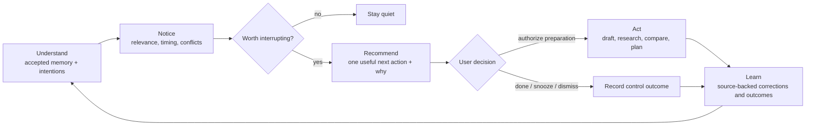

# Zeus

**A local steward of your intentions, grounded in memory you can inspect, correct, and trust.**

Zeus turns what it understands about one person—you—into a useful next action at the
right moment. Durable memory is the evidence layer: it keeps current facts, preserves
what used to be true, links accepted claims to their sources, and holds uncertainty for
review instead of quietly turning it into identity.

The objective is meaningful progress on something the user genuinely cares about,
without creating regret or reducing their control. Conversations, attention, activity,
and raw task count are not success metrics.

The application and SQLite store run on your machine. Chat and memory extraction use
the OpenAI Responses API; local search continues to work without an API key.

## Why Zeus

Most assistant memory fails in one of two ways: old facts linger after life changes, or
the assistant starts treating an inference as something the user actually said. Zeus is
designed around preventing both failures—and around making memory useful through
contextual follow-through.

- **Temporal truth.** Facts have validity windows. A new employer can close the old
  employer without erasing it, so both “Where do I work?” and “Where did I work before?”
  remain answerable.
- **Claim-level provenance.** Every production claim cites an exact user-authored span
  with stable offsets. Later reassertions, field updates, and corrections retain their
  own evidence instead of borrowing provenance from the surrounding message.
- **A review boundary.** Direct, clear statements can be accepted automatically.
  Inference, ambiguity, sensitive material, and unexplained conflicts go to a candidate
  queue for explicit acceptance or rejection.
- **Honest recall.** Retrieval combines full-text search, local embeddings, and entity
  relationships. Calibrated semantic floors allow an unrelated question to return no
  result instead of the least-wrong memory.
- **User control.** Facts can be corrected, closed, revived, or forgotten. Entities can
  be merged, source conversations can be deleted, and the complete store can be exported
  as readable Markdown.
- **Intention stewardship.** One deterministic policy ranks relevance, deadlines,
  waiting, staleness, deadline conflicts, and explicitly stated goal priority. Paused
  goals, cooldowns, snoozes, dismissals, conditional preferences, quiet hours, and
  intervention mode are hard gates. Stewardship can be turned off without disabling
  explicit Today, MCP, or “what should I do?” requests.
- **Permission before action.** Zeus can draft, research, compare, and plan in chat.
  Sending, scheduling, purchasing, reminding, coordinating, or changing external state
  requires explicit confirmation and an available adapter.
- **Outcomes without hiding regret.** Follow-through offers and user decisions form an
  append-only audit trail. Progress, control signals, and regret remain separately
  visible instead of collapsing into an engagement score.

## What it includes

- A streaming chat interface that shows what each turn recalled and learned.
- A memory browser with current facts, historical facts, confidence, evidence, and
  source links.
- Entity dossiers for people, projects, organizations, places, topics, and things.
- A timeline of what Zeus learned and when.
- A review queue for proposed memories that were not safe to accept automatically.
- An **Understanding** workspace for accepted values, constraints, decision criteria,
  preferences, motivations, routines, styles, boundaries, skills, and relationship
  dynamics—with evidence, scope, validity, corrections, and history.
- A user-started, one-question-at-a-time reflection flow and resumable, opt-in preview
  of past conversations.
- Structured goals and commitments with append-only event histories and restrained
  follow-through recommendations.
- Source-backed projects with planned, active, paused, completed, and abandoned
  lifecycles; linked goals and commitments; and append-only progress/blocker history.
- Bounded, resumable work plans for accepted-memory recall, read-only web research, and
  local database-backed drafts, comparisons, and reports. Exact plan hashes, limits,
  authorizations, receipts, citations, and checkpoints remain reviewable.
- Opt-in macOS ambient support with quiet hours, a one-notification-per-day budget,
  short-lived named coarse zones, deterministic background evaluation, and no model call
  in the worker.
- A **Today** view with one best current action, intervention controls, and a transparent
  progress-and-regret readout.
- Source transcripts and per-response recall traces for investigating why Zeus answered
  a particular way.
- A stdio MCP server so other local agents can use the same memory.

## The follow-through loop



The model still proposes memories; deterministic application code decides whether they
are accepted, held, or discarded. Recommendation policy is also deterministic. A
follow-through proposal is stored separately from canonical memory, so an
assistant-authored next step can never become a claimed fact about the user.

## Quick start

Requirements:

- Node.js 22 or newer
- npm
- An OpenAI API key for chat and extraction

From the repository root:

```bash
npm install
cp .env.example .env.local
# Add OPENAI_API_KEY to .env.local
npm run dev
```

Open [http://127.0.0.1:3000](http://127.0.0.1:3000). The server binds to loopback only.

Without `OPENAI_API_KEY`, the memory browser, curation UI, export, tests, and lexical
search still work. Only chat, explicit MCP remembering, and model-backed extraction are
unavailable.

The first semantic search may download `Xenova/bge-small-en-v1.5` into `.models/`. The
model runs locally. Set `ZEUS_EMBEDDINGS=off` to skip it and use full-text plus graph
retrieval only.

### Optional account login

Zeus can use Supabase Auth for passwordless email login and Google login. Supabase stores
identity only; conversations and memory remain in local SQLite files. A web deployment
can serve multiple verified accounts, but it never mixes their data: every account is
bound to a separate personal database by its immutable Supabase UUID.

The original `ZEUS_DB` remains available to an existing installation. Set the optional
`ZEUS_OWNER_EMAIL` migration bridge so that account can claim the original database while
it is still unbound. Other accounts are created under `accounts/<supabase-uuid>.db` beside
`ZEUS_DB`. Once a database is bound, the UUID—not a mutable email address—controls access.

Add these values to `.env.local`:

```bash
NEXT_PUBLIC_SUPABASE_URL=https://YOUR_PROJECT_REF.supabase.co
NEXT_PUBLIC_SUPABASE_PUBLISHABLE_KEY=sb_publishable_YOUR_KEY
NEXT_PUBLIC_SITE_URL=http://127.0.0.1:3000
# Optional only when preserving a pre-multi-account ZEUS_DB:
# ZEUS_OWNER_EMAIL=you@example.com
```

Then configure the Supabase project:

1. Keep email authentication enabled. Supabase's default hosted Magic Link and Confirm
   Signup templates work with Zeus's PKCE callback, so custom SMTP is not required for
   local testing. If you later customize the templates, Zeus also accepts direct
   `token_hash` links.
2. Set the Site URL to `http://127.0.0.1:3000`. Allow redirects to
   `http://127.0.0.1:3000/auth/confirm` and
   `http://127.0.0.1:3000/auth/callback` (plus the production equivalents).
3. Enable Google in Supabase Auth with a Google OAuth client ID and secret. In Google
   Cloud, use `https://YOUR_PROJECT_REF.supabase.co/auth/v1/callback` as the authorized
   redirect URI.

Always open local Zeus at `http://127.0.0.1:3000`, not `http://localhost:3000`.
Email links must be opened in the same browser profile that requested them because the
PKCE verifier is stored in a host-bound cookie. Zeus redirects the login screen to the
configured `NEXT_PUBLIC_SITE_URL` before starting a flow to enforce this.

### Hosting Zeus

Two settings are mandatory once Supabase login is configured, and Zeus enforces both
rather than trusting the deployment:

- **`ZEUS_DB` must point at a mounted persistent volume**, and its parent directory must
  already exist. The default `~/.zeus/zeus.db` sits in the container filesystem, so every
  deploy would silently replace each account's memory with an empty store. Zeus refuses to
  start rather than serve that, and it will not create a missing directory, because a
  missing mount point is precisely the failure worth catching.
- **`ZEUS_ALLOWED_SIGNUP_EMAILS` decides who may create an account.** It is empty by
  default, which admits nobody new: every signup permanently allocates a database, a
  migration run, and an open connection on the host. Accounts that already have a store
  are never affected by the list, so tightening it cannot lock out an existing user.

No Supabase service-role key, database table, or RLS policy is needed. Supabase's default
email sender only delivers to members of the project's organization and is heavily
rate-limited; configure custom SMTP before production use. Leave both the Supabase URL
and publishable key blank to keep local-only mode. Setting only part of the required auth
group locks private web data until configuration is completed.

## Configuration

| Variable | Required | Default | Purpose |
| --- | --- | --- | --- |
| `OPENAI_API_KEY` | For chat/extraction | — | OpenAI API credential |
| `OPENAI_MODEL` | No | `gpt-5.5` | Model used for both chat and extraction |
| `NEXT_PUBLIC_SUPABASE_URL` | For web login | — | Supabase project URL |
| `NEXT_PUBLIC_SUPABASE_PUBLISHABLE_KEY` | For web login | — | Browser-safe Supabase publishable key |
| `NEXT_PUBLIC_SITE_URL` | For web login | `http://127.0.0.1:3000` in the example | Exact app origin used for auth callbacks |
| `ZEUS_OWNER_EMAIL` | Legacy migration only | — | Email allowed to claim an unbound pre-multi-account `ZEUS_DB` |
| `ZEUS_ALLOWED_SIGNUP_EMAILS` | For web login | — (nobody) | Comma-separated emails permitted to create a **new** personal store |
| `ZEUS_DB` | Yes once login is configured | `~/.zeus/zeus.db` | SQLite database path; must be on a mounted volume for a hosted deployment |
| `ZEUS_MIGRATION_BACKUP_RETENTION` | No | `3` | Pre-migration copies kept per store, pruned when a migration runs |
| `ZEUS_SNAPSHOT_DIR` | No | `<database directory>/snapshots` | Absolute directory for verified SQLite snapshots |
| `ZEUS_SNAPSHOT_RETENTION` | No | `14` | Number of newest verified local snapshots to keep |
| `ZEUS_SNAPSHOT_HOUR` | No | `3` | Local hour (`0`–`23`) for the daily macOS snapshot job |
| `ZEUS_EMBEDDINGS` | No | enabled | Set to `off` for FTS5 and graph search only |
| `ZEUS_MODEL_CACHE` | No | `.models` | Local embedding-model cache |
| `ZEUS_SEMANTIC_FLOOR` | No | `0.5` | Minimum fact-vector similarity |
| `ZEUS_EPISODE_SEMANTIC_FLOOR` | No | `0.52` | Minimum user-message similarity |

The semantic floors are model-specific safety thresholds, not general tuning knobs.
Re-measure them before changing the embedding model or lowering either value.

Ambient notifications stay disabled until they are enabled in Settings and the local
LaunchAgent is explicitly installed:

```bash
npm run ambient:install    # deterministic 15-minute macOS worker
npm run ambient:uninstall  # remove the LaunchAgent
```

The worker opens the configured SQLite path directly and performs no OpenAI call. The
browser converts coordinates to a coarse cell and keeps only its cell-to-name mapping
locally; Zeus stores only the name and an observation time that expires after 30 minutes.

### Health and operational events

`GET /api/health` reports whether this process can actually serve, not merely whether it
is listening: it opens the store and reads its migration ledger, so a database that
cannot be opened returns `503` rather than letting `/` keep answering `200` while every
private route fails. It answers before authentication — including while auth itself is
misconfigured, which is exactly when it is worth asking — and returns no user data:
schema version and subsystem availability only.

```bash
curl -s http://127.0.0.1:3000/api/health
{"status":"ok","store":{"status":"ok","migrations_applied":21,"migrations_expected":21},
 "auth":"local","embeddings":"ready","model":"configured"}
```

`embeddings` is reported honestly rather than reassuringly. Semantic search falls back to
full-text for the life of a process when the local model cannot load, which is right for
a chat turn and invisible to an operator; `"unavailable"` says recall got worse while
everything else looks healthy.

Zeus emits one JSON object per line on **stderr** for operational events — denied
requests, failed chat turns, extraction failures, embedding downgrades, exhausted OpenAI
retries. stdout is left alone because it is the MCP server's protocol channel.

These events are built as an **allowlist, not a scrubber**. Zeus's own error strings can
quote the person the store is about, so only declared fields are ever serialized, each is
validated against a shape that cannot hold a sentence, and there is deliberately no
free-form message field and no `error.message`. An error is identified by its class and
the first line of Zeus code in its stack — a code location the operator wrote, never a
sentence the user wrote. A value that does not fit its field is replaced with `invalid`
rather than truncated, so a bad call site is visible instead of leaking half a sentence.

Account ids in events are Supabase UUIDs, which are pseudonymous by design; emails and
display names are never logged.

### Pre-migration backups

Before applying any pending migration to a store that already has one, Zeus writes a
verified full copy beside the database and refuses to migrate if that copy cannot be
made. Each copy is as large as the store and sits on the same volume as the data it
protects, so Zeus keeps only the newest `ZEUS_MIGRATION_BACKUP_RETENTION` of them and
prunes the rest as part of the migration that creates one. Pruning happens *before* the
new copy is written, because stale copies are the likeliest reason a volume is short of
room.

Zeus also checks free space before starting the copy. The backup is taken inside the
migration's writer reservation and before any schema change, so running out of disk
mid-write would abort the migration and leave the volume just as full for the next
attempt — the deploy that would fix the problem is the one that cannot run. Failing up
front reports what is needed while the store is still untouched.

Only validated copies are ever pruned: an unreadable file that merely looks like a
backup is left in place for an operator to inspect rather than quietly removed.

### Scheduled database snapshots

`npm run snapshot` creates a standalone SQLite snapshot with `VACUUM INTO`. It reads a
consistent committed view, including committed WAL state, while the web and MCP
connections remain live. Zeus publishes the file only after the shared database
verification passes: `integrity_check`, foreign keys, the Zeus application marker, and
the exact migration ledger. It then keeps the newest `ZEUS_SNAPSHOT_RETENTION` verified
snapshots in `ZEUS_SNAPSHOT_DIR`.

It covers **every** store: the primary database and each `accounts/<uuid>.db` beside it.
Snapshot filenames are scoped by a hash of their source path, so all stores share one
directory without pruning each other's copies — one directory to replicate off-machine,
and retention counts per store. A store that cannot be read is reported and skipped so
one bad database never costs every other account its backup; the run still exits
non-zero. Use `--only` to operate on the primary store alone.

On macOS, install the dedicated LaunchAgent to run once at load and daily at
`ZEUS_SNAPSHOT_HOUR` local time:

```bash
npm run snapshot             # create and verify one snapshot now
npm run snapshot:install     # install the daily macOS LaunchAgent
npm run snapshot:uninstall   # stop and remove the LaunchAgent
npm run snapshot:verify -- /absolute/path/to/zeus-snapshot.sqlite
```

The installer captures the current database path, snapshot directory, retention, and
hour from `.env.local` (an already-set process environment still takes precedence).
Reinstall it after changing any of those values. Snapshot files are owner-only
(`0600`) but are complete, cleartext copies of the store; keep the directory private and
outside the repository. Explicit source deletion purges Zeus-managed local snapshots for
that database from every destination it has used. Each destination and filesystem
identity is registered in the store before its first snapshot; deletion fails closed
before removing source rows if a registered removable target is unavailable.

#### Restore runbook

Restoring rolls Zeus back to the snapshot time. It discards later changes and can
resurrect information that was explicitly deleted after the snapshot was made.

`npm run restore` performs the whole procedure: it verifies the snapshot before touching
anything, refuses to run while another process holds the store's writer reservation,
renames the current store aside instead of deleting it, moves any WAL/SHM sidecars with
it, and re-verifies the installed file. Without `--yes` it is a dry run that still
verifies the snapshot, so you can confirm a copy is usable before committing to it.

1. Stop every Zeus web process, close MCP clients that use the store, and stop scheduled
   jobs. If installed, run `npm run snapshot:uninstall` and
   `npm run ambient:uninstall`; reinstall them after recovery. The restore refuses to
   proceed if a writer is still attached, but a reader started mid-restore would still
   see a store swapped underneath it.
2. Find the verified snapshots for the store you are recovering. This works even when
   that store is missing or unopenable, which is the usual state during a recovery:

   ```bash
   npm run restore -- --list
   npm run restore -- --db ~/.zeus/accounts/<uuid>.db --list
   ```

3. Dry-run the restore. This verifies the snapshot and reports exactly what would move:

   ```bash
   npm run restore -- --from /absolute/path/to/zeus-snapshot.db
   ```

4. Perform it. Use `--latest` instead of `--from` to take the newest verified snapshot:

   ```bash
   npm run restore -- --from /absolute/path/to/zeus-snapshot.db --yes
   npm run restore -- --db ~/.zeus/accounts/<uuid>.db --latest --yes
   ```

5. Restart Zeus with the same `ZEUS_DB`. The current build migrates an older valid
   snapshot when necessary. Confirm the expected conversations and memory, then remove
   the preserved `*.pre-restore-*` file and reinstall any LaunchAgents you stopped.

Restore one store at a time and name it explicitly; there is deliberately no
restore-everything flag.

#### Optional encrypted off-machine copy

Zeus does not upload snapshots or manage encryption keys. For an opt-in off-machine
copy, run an established encrypted backup tool such as restic only after the local
snapshot command succeeds. Keep its password in an owner-only file outside the
repository rather than in a command argument, and target the snapshot directory with a
dedicated tag or repository. For example, after configuring a restic repository:

```bash
export RESTIC_PASSWORD_FILE=/absolute/path/to/private-restic-password
export RESTIC_REPOSITORY=/absolute/path-or-supported-remote
restic backup /absolute/path/to/zeus-snapshots --tag zeus
```

Off-machine retention and deletion are a separate user-owned boundary. Zeus's explicit
source deletion removes managed local snapshots, not copies already uploaded elsewhere;
expire those with the remote repository's `forget`/`prune` policy. Restore an off-machine
copy to a temporary local path and pass it through `npm run snapshot:verify` before using
the runbook above.

## Using Zeus

Chat normally. After each response, the receipt beneath the answer shows how many memory
items were recalled, accepted, held for review, or superseded.

The main views are:

- **Today** — see one useful next action, choose off/quiet/balanced/proactive intervention,
  inspect progress, control, and regret signals, and authorize, resume, cancel, or review
  bounded work and its receipts.
- **Chat** — converse with Zeus and inspect the memory receipt for each turn.
- **Memory** — search and curate accepted facts or review pending candidates.
- **Understanding** — inspect, correct, close, or delete accepted facets; edit and
  review pending inferences or sensitive proposals; optionally start a reflection or
  historical preview.
- **Open loops** — update goals and commitments, inspect their histories, and snooze
  commitment nudges.
- **Timeline** — see current and superseded facts in learned-at order.
- **Sources** — inspect or delete stored conversations and their dependent memory.

Deleting a source conversation also removes or restores dependent passages, facts,
facets, candidates, goals, commitments, indexes, and recall traces. Independently
supported memory survives with a remaining real source; intention fields are replayed
from surviving events rather than retaining deleted-source state. Permanent deletion
also checkpoints and truncates SQLite's WAL, rebuilds FTS, vacuums and verifies the store,
and removes Zeus-managed pre-migration backups that could retain the erased source.

## MCP integration

Zeus exposes the same database through a stdio MCP server. A generic client
configuration looks like this:

```json
{
  "mcpServers": {
    "zeus": {
      "command": "node",
      "args": ["--env-file-if-exists=.env.local", "--import", "tsx", "src/mcp/server.ts"],
      "cwd": "/absolute/path/to/zeus"
    }
  }
}
```

The example loads `.env.local` when it exists, while preserving environment values set
by the MCP client. Copy it, then update its absolute `cwd` for your checkout:

```bash
cp .mcp.json.example .mcp.json
```

If you use a different launcher, pass the same `ZEUS_DB`, `OPENAI_API_KEY`, and
`OPENAI_MODEL` environment as the web process.

The server provides:

- `zeus_recall` — retrieve relevant accepted memory.
- `zeus_understanding` — retrieve current accepted facets within an explicit scope.
- `zeus_memory_candidates` — inspect pending proposals without treating them as truth.
- `zeus_review_candidate` — explicitly edit/accept or reject one proposal.
- `zeus_remember` — extract durable memory from an explicit statement.
- `zeus_entity` — inspect everything known about one entity.
- `zeus_timeline` — list facts by the date Zeus learned them.
- `zeus_open_loops` — list goals and commitments.
- `zeus_update_open_loop` — update an item only after an explicit user instruction.
- `zeus_next_action` — select one source-backed follow-through recommendation.
- `zeus_follow_through_feedback` — record an explicitly authorized decision on that
  recommendation.

Run `npm run mcp` to launch the same server directly. It writes protocol data only to
stdout and diagnostics to stderr.

Supabase login protects the web interface. The stdio MCP server remains a separate local
trust boundary and opens the specific database selected by `ZEUS_DB`; it does not infer a
web account. `npm run snapshot` and `npm run reindex` cover every account store
automatically. Export still operates on one store at a time — deliberately, so one
directory never mixes two people's personal data — so point `ZEUS_DB` at that account's
UUID-named database to export it or to open MCP against it.

## Commands

| Command | What it does |
| --- | --- |
| `npm run dev` | Start the loopback-only development server |
| `npm run build` | Create a production build |
| `npm run start` | Serve the production build on loopback |
| `npm test` | Run the Vitest suite |
| `npm test -- src/core/facts.test.ts` | Run one test file |
| `npm run lint` | Run ESLint with zero warnings allowed |
| `npm run typecheck` | Run strict TypeScript checking |
| `npm run eval:memory` | Run the deterministic offline trust-policy corpus |
| `npm run check` | Run lint, typecheck, tests, trust evaluation, and build |
| `npm run seed:demo` | Replay fixture extractions into a demo database and assert the result |
| `npm run reindex` | Rebuild FTS5 and any missing embeddings, for every store |
| `npm run reindex -- --fts-only` | Rebuild full-text indexes without embeddings |
| `npm run restore -- --list` | List verified snapshots available for a store |
| `npm run restore -- --latest --yes` | Restore the newest verified snapshot over a store |
| `npm run export` | Export the store as Markdown to `./zeus-export` |
| `npm run export -- /path/to/output` | Export to a private chosen directory (must be empty or a managed Zeus export) |
| `npm run snapshot` | Create and verify an online SQLite snapshot |
| `npm run snapshot:verify -- /absolute/file` | Verify one snapshot without restoring it |
| `npm run snapshot:install` | Install the daily macOS snapshot LaunchAgent |
| `npm run snapshot:uninstall` | Stop and remove the snapshot LaunchAgent |
| `npm run mcp` | Start the stdio MCP server |

`npm run check` is the required development gate.

## Architecture

Zeus is a Next.js 16 and React 19 application written in strict TypeScript. Zod 4 is the
runtime schema and type source. The persistence layer is SQLite through
`better-sqlite3`, with ordered hand-written migrations.

```text
src/core/          framework-free memory engine and colocated tests
src/app/           Next.js routes, server actions, and curation views
src/components/    client and shared UI components
src/server/db.ts   process-wide web-server database handle
src/mcp/server.ts  stdio MCP front door
scripts/           demo seed, evaluation, reindex, and Markdown export
```

Retrieval uses three complementary paths:

1. FTS5 for names and exact wording.
2. Local embeddings for paraphrases.
3. One-hop entity graph expansion for relational context.

Ranked results are combined with reciprocal-rank fusion. Embedding failure is
non-fatal: search falls back to the remaining paths.

## Data and privacy

The default store is `~/.zeus/zeus.db`, outside the repository. SQLite runs with WAL,
foreign keys, a busy timeout, and best-effort owner-only file permissions so the web and
MCP processes can safely share it.

Supported npm commands run `npm run secure:local` first. It enforces owner-only modes on
local environment/credential/key files and repository-local exports without printing
their contents. Exports are staged privately and replace only marker-validated Zeus
export trees, so re-exporting after source deletion cannot leave stale Markdown; a
non-empty arbitrary directory or a symlinked/traversal destination is refused.

What stays local:

- The SQLite store, transcripts, facts, candidates, intentions, and recall traces.
- Follow-through proposals, intervention settings, and user decision events.
- FTS5 indexes and embedding vectors.
- Embedding inference after the model has been downloaded.

What is sent to OpenAI:

- The chat prompt, relevant memory context, and recent transcript needed for a reply.
- A bounded extraction window containing the current user message, at most twelve
  preceding messages, and relevant accepted context. Evidence IDs are restricted to
  the user messages actually present in that window.
- Historical user excerpts only after the user explicitly starts the disclosed
  backfill preview.

Both OpenAI paths use the Responses API with `store: false`. Zeus is local-first, but it
is **not encrypted at rest**: any process running as your operating-system user can read
the database. Treat snapshots and Markdown exports as equally sensitive and do not
commit them.

## Known limitations

- Zeus can prepare drafts, research, comparisons, and plans in chat. This repository has
  no email, calendar, reminder, shopping, or coordination adapters yet, so it never
  claims those external actions happened.

- Natural retraction is intentionally conservative: Zeus closes one multi-valued fact
  only when the subject, predicate, and value resolve to exactly one current claim;
  otherwise it asks for review.
- Shared aliases remain ambiguous until context or explicit curation identifies the
  entity. Zeus does not silently choose the first matching person.
- Vector search is brute-force and intended for personal-scale stores. Around 50,000
  facts, an approximate nearest-neighbor index becomes the next architectural step.
- `npm run seed:demo` uses fixture extractions. It validates the deterministic write path,
  not live model extraction quality.
- The initial longitudinal evaluation corpus is English-first. Trust gates are
  deterministic, while live extraction and response-quality targets still require a
  configured model run before rollout.
