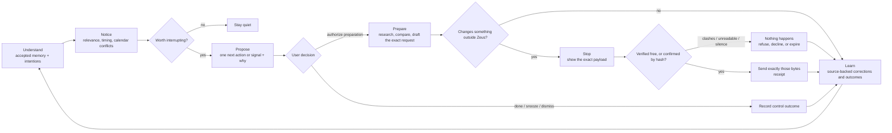

# Zeus

**A local steward of your intentions, grounded in memory you can inspect, correct, and trust.**

Zeus turns what it understands about one person—you—into a useful next action at the
right moment. Durable memory is the evidence layer: it keeps current facts, preserves
what used to be true, links accepted claims to their sources, and holds uncertainty for
review instead of quietly turning it into identity.

The objective is meaningful progress on something the user genuinely cares about,
without creating regret or reducing their control. Conversations, attention, activity,
and raw task count are not success metrics.

The application and SQLite store run on your machine. Chat and memory extraction use
the OpenAI Responses API; local search continues to work without an API key.

## Why Zeus

Most assistant memory fails in one of two ways: old facts linger after life changes, or
the assistant starts treating an inference as something the user actually said. Zeus is
designed around preventing both failures—and around making memory useful through
contextual follow-through.

- **Temporal truth.** Facts have validity windows. A new employer can close the old
  employer without erasing it, so both “Where do I work?” and “Where did I work before?”
  remain answerable.
- **Claim-level provenance.** Every production claim cites an exact user-authored span
  with stable offsets. Later reassertions, field updates, and corrections retain their
  own evidence instead of borrowing provenance from the surrounding message.
- **A review boundary.** Direct, clear statements can be accepted automatically.
  Inference, ambiguity, sensitive material, and unexplained conflicts go to a candidate
  queue for explicit acceptance or rejection.
- **Honest recall.** Retrieval combines full-text search, local embeddings, and entity
  relationships. Calibrated semantic floors allow an unrelated question to return no
  result instead of the least-wrong memory.
- **User control.** Facts can be corrected, closed, revived, or forgotten. Entities can
  be merged, source conversations can be deleted, and the complete store can be exported
  as readable Markdown.
- **Intention stewardship.** One deterministic policy ranks relevance, deadlines,
  waiting, staleness, deadline conflicts, and explicitly stated goal priority. Paused
  goals, cooldowns, snoozes, dismissals, conditional preferences, quiet hours, and
  intervention mode are hard gates. Stewardship can be turned off without disabling
  explicit Today, MCP, or “what should I do?” requests.
- **Permission before action.** Zeus can draft, research, compare, and plan in chat, and —
  once you connect a calendar — read it and carry out changes you asked for. Every change
  is checked against your calendar first: if the time collides with something already
  there, Zeus refuses, names the collision, and offers openings instead. Anything it could
  not verify, and every other kind of external request, stops with the exact payload shown,
  and only a message of yours naming that payload's hash lets it be sent. Silence is not
  consent: an
  unanswered request expires.
- **No credentials in the store.** Zeus reaches other services through reviewed MCP
  capabilities. Manual connections record only commands, URLs, and environment-variable
  names. The guided Google Calendar connection asks `gcloud` for a short-lived ADC token
  in memory; Zeus never stores the token, OAuth client JSON, or active project.
- **Outcomes without hiding regret.** Follow-through offers and user decisions form an
  append-only audit trail. Progress, control signals, and regret remain separately
  visible instead of collapsing into an engagement score.

## What it includes

- A streaming chat interface that shows what each turn recalled and learned.
- A memory browser with current facts, historical facts, confidence, evidence, and
  source links.
- Entity dossiers for people, projects, organizations, places, topics, and things.
- A timeline of what Zeus learned and when.
- A review queue for proposed memories that were not safe to accept automatically.
- An **Understanding** workspace for accepted values, constraints, decision criteria,
  preferences, motivations, routines, styles, boundaries, skills, and relationship
  dynamics—with evidence, scope, validity, corrections, and history.
- A user-started, one-question-at-a-time reflection flow and resumable, opt-in preview
  of past conversations.
- Structured goals and commitments with append-only event histories and restrained
  follow-through recommendations.
- Source-backed projects with planned, active, paused, completed, and abandoned
  lifecycles; linked goals and commitments; and append-only progress/blocker history.
- Bounded, resumable work plans for accepted-memory recall, read-only web research, and
  local database-backed drafts, comparisons, and reports. Exact plan hashes, limits,
  authorizations, receipts, citations, and checkpoints remain reviewable.
- Opt-in macOS ambient support with quiet hours, a one-notification-per-day budget,
  short-lived named coarse zones, deterministic background evaluation, and no model call
  in the worker.
- A local-first guided Google Calendar connection plus advanced custom MCP servers, with
  per-capability grants, live input-schema hashes, and no stored credentials. Ask in plain
  words to add, move, cancel, or clear a window, or to check what clashes; Zeus reads the
  calendar first, answers in ordinary sentences rather than a status panel, and keeps a
  deterministic record of what it did that later turns can still cite.
- Deterministic detection of calendar overlaps, tight turnarounds, deadline collisions, and
  unscheduled commitments, delivered through the same gates as every other interruption.
- A **Today** view with one best current action, external requests awaiting your
  confirmation with their exact payloads, a record of every change Zeus made and what
  authorized it, intervention controls, and a transparent progress-and-regret readout.
- Source transcripts and per-response recall traces for investigating why Zeus answered
  a particular way.
- A stdio MCP server so other local agents can use the same memory.

## The follow-through loop



The model still proposes memories; deterministic application code decides whether they
are accepted, held, or discarded. Recommendation policy is also deterministic. A
follow-through proposal is stored separately from canonical memory, so an
assistant-authored next step can never become a claimed fact about the user.

## Quick start

Requirements:

- Node.js 22 or newer
- npm
- An OpenAI API key for chat and extraction

From the repository root:

```bash
npm install
cp .env.example .env.local
# Add OPENAI_API_KEY to .env.local
npm run dev
```

Open [http://127.0.0.1:3000](http://127.0.0.1:3000). The server binds to loopback only.

Without `OPENAI_API_KEY`, the memory browser, curation UI, export, tests, and lexical
search still work. Only chat, explicit MCP remembering, and model-backed extraction are
unavailable.

`npm run build` caches `Xenova/bge-small-en-v1.5` (~140MB) into `.models/`, so the model
is on disk before the app needs it. The model runs locally and the corpus never leaves
the machine. Set `ZEUS_EMBEDDINGS=off` to skip it and use full-text plus graph retrieval
only, or `ZEUS_SKIP_MODEL_PREFETCH=1` for a build that must not reach the network.

### Optional account login

Zeus can use Supabase Auth for passwordless email login and Google login. Supabase stores
identity only; conversations and memory remain in local SQLite files. A web deployment
can serve multiple verified accounts, but it never mixes their data: every account is
bound to a separate personal database by its immutable Supabase UUID.

The original `ZEUS_DB` remains available to an existing installation. Set the optional
`ZEUS_OWNER_EMAIL` migration bridge so that account can claim the original database while
it is still unbound. Other accounts are created under `accounts/<supabase-uuid>.db` beside
`ZEUS_DB`. Once a database is bound, the UUID—not a mutable email address—controls access.

Add these values to `.env.local`:

```bash
NEXT_PUBLIC_SUPABASE_URL=https://YOUR_PROJECT_REF.supabase.co
NEXT_PUBLIC_SUPABASE_PUBLISHABLE_KEY=sb_publishable_YOUR_KEY
NEXT_PUBLIC_SITE_URL=http://127.0.0.1:3000
# Optional only when preserving a pre-multi-account ZEUS_DB:
# ZEUS_OWNER_EMAIL=you@example.com
```

Then configure the Supabase project:

1. Keep email authentication enabled. Supabase's default hosted Magic Link and Confirm
   Signup templates work with Zeus's PKCE callback, so custom SMTP is not required for
   local testing. If you later customize the templates, Zeus also accepts direct
   `token_hash` links.
2. Set the Site URL to `http://127.0.0.1:3000`. Allow redirects to
   `http://127.0.0.1:3000/auth/confirm` and
   `http://127.0.0.1:3000/auth/callback` (plus the production equivalents).
3. Enable Google in Supabase Auth with a Google OAuth client ID and secret. In Google
   Cloud, use `https://YOUR_PROJECT_REF.supabase.co/auth/v1/callback` as the authorized
   redirect URI.

Always open local Zeus at `http://127.0.0.1:3000`, not `http://localhost:3000`.
Email links must be opened in the same browser profile that requested them because the
PKCE verifier is stored in a host-bound cookie. Zeus redirects the login screen to the
configured `NEXT_PUBLIC_SITE_URL` before starting a flow to enforce this.

### Hosting Zeus

Two settings are mandatory once Supabase login is configured, and Zeus enforces both
rather than trusting the deployment:

- **`ZEUS_DB` must point at a mounted persistent volume**, and its parent directory must
  already exist. The default `~/.zeus/zeus.db` sits in the container filesystem, so every
  deploy would silently replace each account's memory with an empty store. Zeus refuses to
  start rather than serve that, and it will not create a missing directory, because a
  missing mount point is precisely the failure worth catching.
- **`ZEUS_ALLOWED_SIGNUP_EMAILS` decides who may create an account.** It is empty by
  default, which admits nobody new: every signup permanently allocates a database, a
  migration run, and an open connection on the host. Accounts that already have a store
  are never affected by the list, so tightening it cannot lock out an existing user.

No Supabase service-role key, database table, or RLS policy is needed. Supabase's default
email sender only delivers to members of the project's organization and is heavily
rate-limited; configure custom SMTP before production use. Leave both the Supabase URL
and publishable key blank to keep local-only mode. Setting only part of the required auth
group locks private web data until configuration is completed.

For Railway, [`railway.json`](railway.json) keeps the runtime contract in version control:
it binds Next.js to Railway's injected `PORT`, waits for `GET /api/health` before making a
deployment active, and restarts only unexpected failures. The hosted start command runs
Next.js directly instead of through npm, so Railway's expected `SIGTERM` for the previous
deployment does not get mislabeled as an `npm error`. The package-level `npm start`
remains loopback-only for local operation.

Railway's environment log combines lifecycle output from consecutive deployments. A
`Stopping Container` / `SIGTERM` sequence immediately after a new process becomes ready
normally belongs to the previous deployment being retired. Open the deployment-specific
log or filter by replica before treating that sequence as a crash in the new process.

Run **one instance**. The bounded-work concurrency cap and the snapshot scheduler are both
process-local, so a second replica silently doubles the first and gives the second a rival
backup timer against the same volume. Zeus does not enforce this, and a mounted volume
belongs to one service, so it is a setting to confirm rather than a guarantee to assume.

#### Rolling back a release

**A release that contains a migration cannot be rolled back by deploying the previous
image.** This is the most important operational fact about Zeus, and it is a consequence of
a deliberate safety property rather than a defect: `validateMigrationLedger` refuses a store
whose applied ledger is not an exact ordered prefix of the running build, because a build
that does not recognise the schema in front of it must not write to it. A store migrated by
release N therefore refuses to open under release N−1.

The failure is quiet in the worst way. `openDb()` migrates on open and `GET /api/health`
opens the store, so the rolled-back deployment fails its own health check and never becomes
active. Because a volume-backed service cannot keep two deployments live, there is no
previous container still serving: the service is down for every account and stays down.
Railway's Rollback button is the natural reflex after a bad release, and on this deployment
it makes the incident worse.

**Prefer rolling forward.** Ship a fix on top. It is almost always faster than any restore,
and it is the only path that does not discard data.

**When you must go back past a migration**, the restore runbook below is the procedure, with
one hosted-specific complication: `npm run restore` refuses to run while a writer holds the
store, and on Railway the writer is the service itself — stopping which normally removes the
shell you would restore from. Break that circle by replacing the process rather than removing
it:

1. Set the service's start command to `sleep infinity` and redeploy. The container keeps the
   volume mounted with no Zeus process attached to the store.
2. `railway ssh` into it, then restore each store explicitly — the primary and every
   `accounts/<uuid>.db` — using the runbook below. There is deliberately no
   restore-everything flag; name each store.
3. Restore the original start command and deploy the older image.

Rehearse this against a staging volume before you need it, and time it. Until it has been
rehearsed, the recovery time is an assumption rather than a number.

**Design new migrations so this bites less often.** Prefer expand/contract: add nullable
columns and new tables in one release, and stop reading the old shape in the next. That keeps
one release of backward compatibility, which turns most rollbacks back into ordinary
redeploys.

## Configuration

| Variable | Required | Default | Purpose |
| --- | --- | --- | --- |
| `OPENAI_API_KEY` | For chat/extraction | — | OpenAI API credential |
| `OPENAI_MODEL` | No | `gpt-5.6-luna` | Model used for both chat and extraction |
| `NEXT_PUBLIC_SUPABASE_URL` | For web login | — | Supabase project URL |
| `NEXT_PUBLIC_SUPABASE_PUBLISHABLE_KEY` | For web login | — | Browser-safe Supabase publishable key |
| `NEXT_PUBLIC_SITE_URL` | For web login | `http://127.0.0.1:3000` in the example | Exact app origin used for auth callbacks |
| `ZEUS_OWNER_EMAIL` | Legacy migration only | — | Email allowed to claim an unbound pre-multi-account `ZEUS_DB` |
| `ZEUS_ALLOWED_SIGNUP_EMAILS` | For web login | — (nobody) | Comma-separated emails permitted to create a **new** personal store |
| `ZEUS_DB` | Yes once login is configured | `~/.zeus/zeus.db` | SQLite database path; must be on a mounted volume for a hosted deployment |
| `ZEUS_MODEL_CALLS_PER_MINUTE` | No | `20` | Per-account model calls per minute |
| `ZEUS_MODEL_CALLS_PER_DAY` | No | `500` | Per-account model calls per day |
| `ZEUS_MODEL_TOKENS_PER_DAY` | No | `2000000` | Per-account model tokens per day |
| `ZEUS_MAX_CONCURRENT_WORK_RUNS` | No | `2` | Bounded work runs this process executes at once |
| `ZEUS_CONNECTOR_CALLS_PER_MINUTE` | No | `30` | Calls to connected services per minute |
| `ZEUS_CONNECTOR_CALLS_PER_DAY` | No | `1000` | Calls to connected services per day |
| `GOOGLE_CALENDAR_BROKER_URL` | For hosted Calendar | — | Exact HTTPS origin of the separate Calendar broker |
| `GOOGLE_CALENDAR_BROKER_SERVICE_KEY` | For hosted Calendar | — | Shared Zeus-to-broker key; at least 32 bytes and never exposed to generic connectors |
| `ZEUS_SYNCHRONOUS` | No | `full` | `full` fsyncs each commit; `normal` trades host-crash durability for speed |
| `ZEUS_MIGRATION_BACKUP_RETENTION` | No | `3` | Pre-migration copies kept per store, pruned when a migration runs |
| `ZEUS_SNAPSHOT_SCHEDULER` | No | on when hosted | In-process scheduled snapshots (`on`/`off`) |
| `ZEUS_SNAPSHOT_INTERVAL_HOURS` | No | `24` | How stale a store's newest snapshot may get |
| `ZEUS_SNAPSHOT_DIR` | No | `<database directory>/snapshots` | Absolute directory for verified SQLite snapshots |
| `ZEUS_SNAPSHOT_RETENTION` | No | `14` | Number of newest verified local snapshots to keep |
| `ZEUS_SNAPSHOT_HOUR` | No | `3` | Local hour (`0`–`23`) for the daily macOS snapshot job |
| `ZEUS_SNAPSHOT_REPLICA_COMMAND` | Strongly advised when hosted | — | Command run on each verified snapshot to copy it off the volume; no shell, path appended as the last argument |
| `ONNXRUNTIME_NODE_INSTALL` | Build-time, hosted | — | Set to `skip` so `npm ci` does not fetch ~196MB of unused CUDA libraries from nuget.org |
| `ZEUS_EMBEDDINGS` | No | enabled | Set to `off` for FTS5 and graph search only |
| `ZEUS_MODEL_CACHE` | No | `.models` | Embedding-model cache; resolved to an absolute path |
| `ZEUS_WARM_EMBEDDINGS` | No | on when hosted | Load the model at startup rather than on first search |
| `ZEUS_SKIP_MODEL_PREFETCH` | No | — | Skip the build-time model download |
| `ZEUS_SEMANTIC_FLOOR` | No | `0.5` | Minimum fact-vector similarity |
| `ZEUS_EPISODE_SEMANTIC_FLOOR` | No | `0.52` | Minimum user-message similarity |

The semantic floors are model-specific safety thresholds, not general tuning knobs.
Re-measure them before changing the embedding model or lowering either value.

Ambient notifications stay disabled until they are enabled in Settings and the local
LaunchAgent is explicitly installed:

```bash
npm run ambient:install    # deterministic 15-minute macOS worker
npm run ambient:uninstall  # remove the LaunchAgent
```

The worker opens the configured SQLite path directly and performs no OpenAI call. The
browser converts coordinates to a coarse cell and keeps only its cell-to-name mapping
locally; Zeus stores only the name and an observation time that expires after 30 minutes.

### Health and operational events

`GET /api/health` reports whether this process can actually serve, not merely whether it
is listening: it opens the store and reads its migration ledger, so a database that
cannot be opened returns `503` rather than letting `/` keep answering `200` while every
private route fails. It answers before authentication — including while auth itself is
misconfigured, which is exactly when it is worth asking — and returns no user data:
schema version and subsystem availability only.

```bash
curl -s http://127.0.0.1:3000/api/health
{"status":"ok","store":{"status":"ok","migrations_applied":21,"migrations_expected":21},
 "auth":"local","embeddings":"ready","model":"configured"}
```

`embeddings` is reported honestly rather than reassuringly. Semantic search falls back to
full-text for the life of a process when the local model cannot load, which is right for
a chat turn and invisible to an operator; `"unavailable"` says recall got worse while
everything else looks healthy.

Zeus emits one JSON object per line on **stderr** for operational events — denied
requests, failed chat turns, extraction failures, embedding downgrades, exhausted OpenAI
retries. stdout is left alone because it is the MCP server's protocol channel.

These events are built as an **allowlist, not a scrubber**. Zeus's own error strings can
quote the person the store is about, so only declared fields are ever serialized, each is
validated against a shape that cannot hold a sentence, and there is deliberately no
free-form message field and no `error.message`. An error is identified by its class and
the first line of Zeus code in its stack — a code location the operator wrote, never a
sentence the user wrote. A value that does not fit its field is replaced with `invalid`
rather than truncated, so a bad call site is visible instead of leaking half a sentence.

Account ids in events are Supabase UUIDs, which are pseudonymous by design; emails and
display names are never logged. A route is reported as its **template** — `/entity/[slug]`,
never `/entity/jane-okafor` — because a slug is `slugify(entity.name)`, which is to say a
person's name out of the store. The template comes from a closed list of this app's routes,
and a path that matches none of them is reported as `/unmatched` rather than passed through,
so the guarantee holds by construction rather than by pattern-matching.

#### What an incident looks like

The events worth knowing by name, because they answer the questions an incident actually
raises:

| Question | Events |
| --- | --- |
| Is one account broken, or everyone? | Every event carries `account` where the store is bound. `store_opened` / `store_open_failed` name the account whose memory would not load. |
| Did the schema change land? | `migration_started` / `migration_applied` / `migration_failed`. The primary store migrates during the deploy's health check; each account store migrates on its owner's next request, so these arrive over hours. |
| Why did a migration stop? | `migration_failed`'s `reason`: `reservation_failed` (another writer held the lock — the likeliest one), `ledger_mismatch` (**the deploy went backwards**; roll the code forward, never touch the store), `backup_space`, `dangling_references`, and four more. |
| Is auth working? | `auth_unavailable` when Supabase cannot be reached — every user is locked out and this is the only thing that says so. `owner_access_denied` with `reason: wrong_account` means a store was reached by an identity it is not bound to. |
| Are backups running? | `snapshot_created` / `snapshot_failed`, and `snapshot_replicated` / `snapshot_replication_failed` for the copy that leaves the volume. |
| Is work running? | `work_run_started` / `work_run_stopped` pair exactly, so runs-in-flight is their difference. `work_run_lease_lost` means a lease was taken or expired — never an ordinary cancellation. |
| What kind of failure was that? | `error_code` carries the machine code behind the class, so `SQLITE_FULL` (free the volume), `SQLITE_CORRUPT` (restore), `SQLITE_BUSY` (contention) and `SQLITE_READONLY` (remount) stop arriving as one indistinguishable line. |

Two deliberate silences. A signed-out visitor is the ordinary state of the web and is not
logged; an alert that fires on it gets muted, which costs more than it gives. And repeated
refusals of the same kind are windowed rather than emitted per request, because
`getOwnerAccess` runs more than once per page render.

#### Something has to read it

Railway probes `/api/health` **once**, before routing traffic to a new deployment. It is
not a continuous check, so after a deploy goes green every state this endpoint exists to
expose is computed by nobody — and with `restartPolicyMaxRetries` at 3, a crash loop ends
with the service down and no one told.

[`.github/workflows/health.yml`](.github/workflows/health.yml) is the standing probe. Set
the repository secret **`ZEUS_HEALTH_URL`** to the deployment's health endpoint and it runs
every fifteen minutes, failing the workflow — and so notifying you — on a non-200, an
unopenable store, a snapshot scheduler that is not running, a snapshot run that finished
`failed` or `partial`, a snapshot that has not run for two intervals, or an off-box copy
that failed. Degradations that are not outages, such as `embeddings: "unavailable"` or no
replication command being configured, are raised as warnings so the alarm keeps meaning
something. With the secret unset the workflow skips rather than fails, so a fork or a
fresh clone stays green.

GitHub's scheduler is best-effort and disables scheduled workflows on repositories with no
recent commits, so treat a *missing* run as unknown rather than healthy. This is the
cheapest useful monitor, not the best one; a dedicated uptime service polling the same
endpoint is strictly better and reports the outages that take GitHub with them.

### Model budget and concurrency

Every model call spends one shared OpenAI key. Nothing previously bounded how many an
account could make, so a loop over `POST /api/chat` — or a client retrying a failed turn
forever — could spend without limit and take every other account's budget with it.

Two ceilings, per account, because they answer different questions. The per-minute window
stops a runaway loop while a person is still typing; the daily windows bound the bill.
Counters live in each account's own database rather than in memory, because a spend limit
that a restart or crash-loop clears is not a spend limit.

Requests over a ceiling are refused with `429` and a `Retry-After` before any model work
happens, so the request that exceeds the limit costs nothing. The reply says which limit
was reached and when it clears. **Memory browsing, curation, search, timeline, export, and
every non-model feature keep working** — a spent budget stops new model calls, not access
to the memory already recorded.

Separately, `ZEUS_MAX_CONCURRENT_WORK_RUNS` bounds how many bounded work runs execute at
once. A run holds its request open for up to 900 seconds, and Zeus serves from a single
Node process, so without a cap a few runs starve ordinary chat traffic behind them. That
cap is per process and in memory — a restart really does free every slot — so running
more than one instance multiplies it.

Work-run execution still happens on the request path. Moving it onto a queue would remove
the 900-second request entirely; the runner-lease machinery already supports resuming a
run from another process.

### Durability

Zeus commits with `synchronous=FULL`. WAL with `NORMAL` does not fsync on commit: a
process crash is safe because the log is already written, but a host crash or power loss
can lose the most recently committed transactions — the last facts a user just watched
Zeus learn, which is precisely the thing this store exists to keep.

Measured on this write path: **0.06ms per commit at `NORMAL` against 0.14ms at `FULL`**,
with no measurable difference for rows written inside one transaction, where fsync
happens once per commit rather than once per row. A chat turn makes a handful of commits
and is dominated by a multi-second model call, so the durability is close to free.

That measurement is from macOS, whose fsync does not force a drive cache flush the way
Linux does, and network-attached storage can make fsync markedly slower.
`ZEUS_SYNCHRONOUS=normal` reverts without a code change if a volume turns out to be slow.

The write-ahead log is checkpointed every 30 minutes so a server that stays up for weeks
does not grow one indefinitely, and again when the process is asked to stop. The
shutdown checkpoint is passive: it never waits for a reader, so a redeploy is not delayed
and a request still draining does not find its store pulled away. Stores are checkpointed
but deliberately not closed, since closing them would trade a tidy log for a failed turn.

### The embedding model on a hosted deployment

Semantic search runs a local ONNX model, which is a ~140MB download on a cache miss.
Three things keep that out of a user's request:

- **`npm run build` prefetches it**, so a deployment ships with the model already cached
  rather than fetching it the first time somebody searches. The prefetch uses the same
  load path the server does, so what the build caches is exactly what the runtime looks
  for. It never fails the build — the runtime falls back to full-text on its own, and
  failing a deploy over a CDN blip would be the worse outcome.
- **`ZEUS_MODEL_CACHE` should point at the mounted volume.** It is resolved to an
  absolute path, so a process started from a different working directory cannot download
  a second copy, and a cache on the volume makes the download a one-time cost rather
  than a per-deploy one.
- **The model loads at startup**, not inside whichever request searches first. The
  warm-up is never awaited and never throws: search answers from full-text until the
  model is ready. On by default for a hosted deployment, off in development so
  `npm run dev` does not pull 140MB unasked.

A failed load is retried after a cooldown rather than disabling semantic search for the
life of the process. A momentary problem at startup used to leave a permanently
worse-answering server that still looked healthy. `GET /api/health` reports the model
under `embeddings`, so a downgrade is visible rather than silent.

### Pre-migration backups

Before applying any pending migration to a store that already has one, Zeus writes a
verified full copy beside the database and refuses to migrate if that copy cannot be
made. Each copy is as large as the store and sits on the same volume as the data it
protects, so Zeus keeps only the newest `ZEUS_MIGRATION_BACKUP_RETENTION` of them and
prunes the rest as part of the migration that creates one. Pruning happens *before* the
new copy is written, because stale copies are the likeliest reason a volume is short of
room.

Zeus also checks free space before starting the copy. The backup is taken inside the
migration's writer reservation and before any schema change, so running out of disk
mid-write would abort the migration and leave the volume just as full for the next
attempt — the deploy that would fix the problem is the one that cannot run. Failing up
front reports what is needed while the store is still untouched.

Only validated copies are ever pruned: an unreadable file that merely looks like a
backup is left in place for an operator to inspect rather than quietly removed.

### Scheduled database snapshots

`npm run snapshot` creates a standalone SQLite snapshot with `VACUUM INTO`. It reads a
consistent committed view, including committed WAL state, while the web and MCP
connections remain live. Zeus publishes the file only after the shared database
verification passes: `integrity_check`, foreign keys, the Zeus application marker, and
the exact migration ledger. It then keeps the newest `ZEUS_SNAPSHOT_RETENTION` verified
snapshots in `ZEUS_SNAPSHOT_DIR`.

It covers **every** store: the primary database and each `accounts/<uuid>.db` beside it.
Snapshot filenames are scoped by a hash of their source path, so all stores share one
directory without pruning each other's copies — one directory to replicate off-machine,
and retention counts per store. A store that cannot be read is reported and skipped so
one bad database never costs every other account its backup; the run still exits
non-zero. Use `--only` to operate on the primary store alone.

#### On a hosted deployment

Scheduled snapshots run **inside the server process**, and are on by default once
Supabase login is configured and `NODE_ENV=production`. The macOS LaunchAgent below
shells out to `launchctl`, which does not exist on the Linux host a hosted deployment
actually runs on — so `npm run snapshot` was portable but nothing was calling it there,
and a deployment shipped with a documented, tested backup mechanism that was not running.

An in-process timer rather than a platform cron job because a mounted volume belongs to
one service: a separate cron container would not have the store to copy. The server that
already holds the volume is the only place with both the data and a clock.

Whether a snapshot is due is read from the newest snapshot on disk, not from a timer's
memory. That is what makes it correct across restarts — a redeploy every ten minutes
cannot produce a snapshot every ten minutes, and a process that was down all night takes
one as soon as it returns. Every store is considered separately, so an account created
today is backed up today rather than waiting for the primary store's next turn.

A failing backup can never take the server down: one unreadable store does not stop the
others, and no snapshot problem reaches a user's request. `GET /api/health` reports the
scheduler under `snapshots`, so a backup that silently stopped is visible rather than
assumed.

`ZEUS_SNAPSHOT_SCHEDULER=off` disables it; `=on` enables it anywhere, including local
development.

Ambient notifications stay macOS-only on purpose. They deliver to a desktop notification
centre, which a headless Linux host does not have; the scheduler here covers backups,
which is the part a deployment genuinely needs.

#### On macOS

On macOS, install the dedicated LaunchAgent to run once at load and daily at
`ZEUS_SNAPSHOT_HOUR` local time:

```bash
npm run snapshot             # create and verify one snapshot now
npm run snapshot:install     # install the daily macOS LaunchAgent
npm run snapshot:uninstall   # stop and remove the LaunchAgent
npm run snapshot:verify -- /absolute/path/to/zeus-snapshot.sqlite
```

The installer captures the current database path, snapshot directory, retention, and
hour from `.env.local` (an already-set process environment still takes precedence).
Reinstall it after changing any of those values. Snapshot files are owner-only
(`0600`) but are complete, cleartext copies of the store; keep the directory private and
outside the repository. Explicit source deletion purges Zeus-managed local snapshots for
that database from every destination it has used. Each destination and filesystem
identity is registered in the store before its first snapshot; deletion fails closed
before removing source rows if a registered removable target is unavailable.

#### Restore runbook

Restoring rolls Zeus back to the snapshot time. It discards later changes and can
resurrect information that was explicitly deleted after the snapshot was made.

`npm run restore` performs the whole procedure: it verifies the snapshot before touching
anything, refuses to run while another process holds the store's writer reservation,
renames the current store aside instead of deleting it, moves any WAL/SHM sidecars with
it, and re-verifies the installed file. Without `--yes` it is a dry run that still
verifies the snapshot, so you can confirm a copy is usable before committing to it.

1. Stop every Zeus web process, close MCP clients that use the store, and stop scheduled
   jobs. If installed, run `npm run snapshot:uninstall` and
   `npm run ambient:uninstall`; reinstall them after recovery. The restore refuses to
   proceed if a writer is still attached, but a reader started mid-restore would still
   see a store swapped underneath it.
2. Find the verified snapshots for the store you are recovering. This works even when
   that store is missing or unopenable, which is the usual state during a recovery:

   ```bash
   npm run restore -- --list
   npm run restore -- --db ~/.zeus/accounts/<uuid>.db --list
   ```

3. Dry-run the restore. This verifies the snapshot and reports exactly what would move:

   ```bash
   npm run restore -- --from /absolute/path/to/zeus-snapshot.db
   ```

4. Perform it. Use `--latest` instead of `--from` to take the newest verified snapshot:

   ```bash
   npm run restore -- --from /absolute/path/to/zeus-snapshot.db --yes
   npm run restore -- --db ~/.zeus/accounts/<uuid>.db --latest --yes
   ```

5. Restart Zeus with the same `ZEUS_DB`. The current build migrates an older valid
   snapshot when necessary. Confirm the expected conversations and memory, then remove
   the preserved `*.pre-restore-*` file and reinstall any LaunchAgents you stopped.

Restore one store at a time and name it explicitly; there is deliberately no
restore-everything flag.

#### Encrypted off-machine copy

**A snapshot beside the store is not yet a backup.** The volume that loses the database
loses its snapshots and its pre-migration backups in the same moment, so on a hosted
deployment an off-machine copy is the difference between an incident and an ending. Zeus
still does not upload anything itself or manage encryption keys — it runs a command you
choose, so credentials stay with the tool that owns them.

On a workstation, run an established encrypted backup tool after the local snapshot
command succeeds. Keep its password in an owner-only file outside the repository rather
than in a command argument, and target the snapshot directory with a dedicated tag or
repository:

```bash
export RESTIC_PASSWORD_FILE=/absolute/path/to/private-restic-password
export RESTIC_REPOSITORY=/absolute/path-or-supported-remote
restic backup /absolute/path/to/zeus-snapshots --tag zeus
```

On a hosted deployment there is no shell to chain that to — snapshots run inside the
server process on a timer — so set **`ZEUS_SNAPSHOT_REPLICA_COMMAND`** instead. Zeus runs
it once per snapshot, after the copy has been created *and verified*, appending the
snapshot's absolute path as the final argument:

```bash
ZEUS_SNAPSHOT_REPLICA_COMMAND=/usr/local/bin/restic backup --tag zeus
# runs: restic backup --tag zeus /data/snapshots/<store>-<timestamp>-<uuid>.db
```

The value is split on whitespace into argv and spawned without a shell, so nothing is
expanded and a path containing spaces or shell characters stays one literal argument.
There is deliberately no quoting, no pipe, and no chaining: anything that needs them
belongs in a script you point this at. Give that script its own environment for
`RESTIC_PASSWORD_FILE` and friends — Zeus reads none of it and stores none of it.

Replication is best effort by design. A snapshot that was created and verified is already
a success, so a failed copy never turns a good backup into a failed one; it is logged as
`snapshot_replication_failed` and surfaced on `/api/health` under `replication`, which is
what the scheduled health workflow alerts on. Verify it is actually working after the
first deploy rather than assuming — `replication.state` reports whether a command is
configured at all, which is the failure mode worth catching early.

Off-machine retention and deletion are a separate user-owned boundary. Zeus's explicit
source deletion removes managed local snapshots, not copies already uploaded elsewhere;
expire those with the remote repository's `forget`/`prune` policy. Restore an off-machine
copy to a temporary local path and pass it through `npm run snapshot:verify` before using
the runbook above.

## Using Zeus

Chat normally. After each response, the receipt beneath the answer shows how many memory
items were recalled, accepted, held for review, or superseded.

The main views are:

- **Today** — see one useful next action, confirm or refuse external requests with their
  exact payloads, choose off/quiet/balanced/proactive intervention, inspect progress,
  control, and regret signals, and authorize, resume, cancel, or review bounded work and
  its receipts.
- **Chat** — converse with Zeus and inspect the memory receipt for each turn.
- **Memory** — search and curate accepted facts or review pending candidates.
- **Understanding** — inspect, correct, close, or delete accepted facets; edit and
  review pending inferences or sensitive proposals; optionally start a reflection or
  historical preview.
- **Settings → Connections** — connect Google Calendar through a guided read-only-by-default
  checklist, manage its permissions, or open Advanced to configure and review a custom MCP
  server capability by capability.
- **Open loops** — update goals and commitments, inspect their histories, and snooze
  commitment nudges.
- **Timeline** — see current and superseded facts in learned-at order.
- **Sources** — inspect or delete stored conversations and their dependent memory.

Deleting a source conversation also removes or restores dependent passages, facts,
facets, candidates, goals, commitments, indexes, and recall traces. Independently
supported memory survives with a remaining real source; intention fields are replayed
from surviving events rather than retaining deleted-source state. Permanent deletion
also checkpoints and truncates SQLite's WAL, rebuilds FTS, vacuums and verifies the store,
and removes Zeus-managed pre-migration backups that could retain the erased source.

The guided Google Calendar preset is available only in loopback/local mode. It targets
Google's official Developer Preview MCP endpoint and verifies the live `list_events`,
`create_event`, and `update_event` schemas before saving a grant. Google Cloud project,
API, IAM, Desktop OAuth client, and Application Default Credentials setup remains an
explicit user-run prerequisite; Zeus provides copyable commands but never changes those
resources. A selected write permission lets Zeus carry out changes you ask for once it has
read your calendar and found the time free; anything it cannot verify still stops at the
exact-payload confirmation gate.

That gate lives in the conversation. When a change needs your word — the time is taken, the
calendar could not be read, or you asked to clear a whole window — Zeus explains why and puts
the exact confirmation line in your message box. Sending it is what authorizes the change, so
the message naming the payload is genuinely yours; saying "yes, go ahead" without it does
nothing, and a plain "no" drops the request. Clearing a window always asks, whatever your
standing setting says, and lists every event it would cancel first.

## MCP integration

Zeus exposes the same database through a stdio MCP server. A generic client
configuration looks like this:

```json
{
  "mcpServers": {
    "zeus": {
      "command": "node",
      "args": ["--env-file-if-exists=.env.local", "--import", "tsx", "src/mcp/server.ts"],
      "cwd": "/absolute/path/to/zeus"
    }
  }
}
```

The example loads `.env.local` when it exists, while preserving environment values set
by the MCP client. Copy it, then update its absolute `cwd` for your checkout:

```bash
cp .mcp.json.example .mcp.json
```

If you use a different launcher, pass the same `ZEUS_DB`, `OPENAI_API_KEY`, and
`OPENAI_MODEL` environment as the web process.

The server provides:

- `zeus_recall` — retrieve relevant accepted memory.
- `zeus_understanding` — retrieve current accepted facets within an explicit scope.
- `zeus_memory_candidates` — inspect pending proposals without treating them as truth.
- `zeus_review_candidate` — explicitly edit/accept or reject one proposal.
- `zeus_remember` — extract durable memory from an explicit statement.
- `zeus_entity` — inspect everything known about one entity.
- `zeus_timeline` — list facts by the date Zeus learned them.
- `zeus_open_loops` — list goals and commitments.
- `zeus_update_open_loop` — update an item only after an explicit user instruction.
- `zeus_next_action` — select one source-backed follow-through recommendation.
- `zeus_follow_through_feedback` — record an explicitly authorized decision on that
  recommendation.
- `zeus_pending_effects` — list external requests prepared but not sent.
- `zeus_confirm_effect` — confirm one exact request by its payload hash, then send it.

Run `npm run mcp` to launch the same server directly. It writes protocol data only to
stdout and diagnostics to stderr.

Supabase login protects the web interface. The stdio MCP server remains a separate local
trust boundary and opens the specific database selected by `ZEUS_DB`; it does not infer a
web account. `npm run snapshot` and `npm run reindex` cover every account store
automatically. Export still operates on one store at a time — deliberately, so one
directory never mixes two people's personal data — so point `ZEUS_DB` at that account's
UUID-named database to export it or to open MCP against it.

## Multi-user Google Calendar

Google Calendar uses a separate credential-broker service. Zeus stores an opaque broker
connection id and the reviewed MCP schemas, but never a Google access token, refresh
token, OAuth client secret, or token-encryption key. Each broker grant is bound to the
immutable Supabase UUID from the user's personal Zeus store.

Create a second Railway service from this repository and select
[`railway.calendar-broker.json`](railway.calendar-broker.json) as its configuration file.
Attach a persistent volume at `/data`, then set these variables on the broker service:

```bash
GOOGLE_CALENDAR_BROKER_DB=/data/google-calendar-broker.db
GOOGLE_CALENDAR_TOKEN_ENCRYPTION_KEY=<base64 of 32 random bytes>
GOOGLE_CALENDAR_BROKER_SERVICE_KEY=<at least 32 random bytes>
ZEUS_APP_URL=https://www.zeusagent.dev
GOOGLE_OAUTH_CLIENT_ID=<development web client id>
GOOGLE_OAUTH_CLIENT_SECRET=<development web client secret>
GOOGLE_OAUTH_REDIRECT_URI=https://calendar.zeusagent.dev/oauth/google/callback
```

Generate independent encryption and service keys, for example:

```bash
openssl rand -base64 32
openssl rand -base64 48
```

Assign `calendar.zeusagent.dev` to the broker service. On the main Zeus Railway
service, set only:

```bash
GOOGLE_CALENDAR_BROKER_URL=https://calendar.zeusagent.dev
GOOGLE_CALENDAR_BROKER_SERVICE_KEY=<the same broker service key>
```

The Connections screen then offers **Connect Google Calendar**. Initial consent grants
event reads only. Enabling calendar changes starts a second incremental OAuth consent.
Zeus then reads your calendar before every create, move, or cancel and acts only when the
requested time is free; a collision, an unreadable calendar, or an ambiguous event stops
for your exact confirmation. Turn confirmations back on for everything with **Make changes
without asking me each time** on the same screen. Disconnect first revokes the Google grant
and only then removes the local connector row.

## Commands

| Command | What it does |
| --- | --- |
| `npm run dev` | Start the loopback-only development server |
| `npm run build` | Create a production build |
| `npm run start` | Serve the production build on loopback |
| `npm test` | Run the Vitest suite |
| `npm test -- src/core/facts.test.ts` | Run one test file |
| `npm run lint` | Run ESLint with zero warnings allowed |
| `npm run typecheck` | Run strict TypeScript checking |
| `npm run eval:memory` | Run the deterministic offline trust-policy corpus |
| `npm run check` | Run lint, typecheck, tests, trust evaluation, and build |
| `npm run seed:demo` | Replay fixture extractions into a demo database and assert the result |
| `npm run reindex` | Rebuild FTS5 and any missing embeddings, for every store |
| `npm run reindex -- --fts-only` | Rebuild full-text indexes without embeddings |
| `npm run restore -- --list` | List verified snapshots available for a store |
| `npm run restore -- --latest --yes` | Restore the newest verified snapshot over a store |
| `npm run export` | Export the store as Markdown to `./zeus-export` |
| `npm run export -- /path/to/output` | Export to a private chosen directory (must be empty or a managed Zeus export) |
| `npm run snapshot` | Create and verify an online SQLite snapshot |
| `npm run snapshot:verify -- /absolute/file` | Verify one snapshot without restoring it |
| `npm run snapshot:install` | Install the daily macOS snapshot LaunchAgent |
| `npm run snapshot:uninstall` | Stop and remove the snapshot LaunchAgent |
| `npm run mcp` | Start the stdio MCP server |
| `npm run calendar:broker` | Start the separate Google Calendar credential broker |

`npm run check` is the required development gate.

## Architecture

Zeus is a Next.js 16 and React 19 application written in strict TypeScript. Zod 4 is the
runtime schema and type source. The persistence layer is SQLite through
`better-sqlite3`, with ordered hand-written migrations.

```text
src/core/          framework-free memory engine and colocated tests
src/app/           Next.js routes, server actions, and curation views
src/components/    client and shared UI components
src/server/db.ts   process-wide web-server database handle
src/mcp/server.ts  stdio MCP front door
scripts/           demo seed, evaluation, reindex, and Markdown export
```

Retrieval uses three complementary paths:

1. FTS5 for names and exact wording.
2. Local embeddings for paraphrases.
3. One-hop entity graph expansion for relational context.

Ranked results are combined with reciprocal-rank fusion. Embedding failure is
non-fatal: search falls back to the remaining paths.

## Data and privacy

The default store is `~/.zeus/zeus.db`, outside the repository. SQLite runs with WAL,
foreign keys, a busy timeout, and best-effort owner-only file permissions so the web and
MCP processes can safely share it.

Supported npm commands run `npm run secure:local` first. It enforces owner-only modes on
local environment/credential/key files and repository-local exports without printing
their contents. Exports are staged privately and replace only marker-validated Zeus
export trees, so re-exporting after source deletion cannot leave stale Markdown; a
non-empty arbitrary directory or a symlinked/traversal destination is refused.

What stays local:

- The SQLite store, transcripts, facts, candidates, intentions, and recall traces.
- Follow-through proposals, detected signals, intervention settings, and user decisions.
- Connector configuration, capability grants, prepared external requests, and receipts.
- FTS5 indexes and embedding vectors.
- Embedding inference after the model has been downloaded.

What is sent to OpenAI:

- The chat prompt, relevant memory context, and recent transcript needed for a reply.
- A bounded extraction window containing the current user message, at most twelve
  preceding messages, and relevant accepted context. Evidence IDs are restricted to
  the user messages actually present in that window.
- Historical user excerpts only after the user explicitly starts the disclosed
  backfill preview.
- When a calendar is connected: your own request, so the intent classifier can resolve what
  you asked for. Calendar text is never sent to that classifier, and the payload itself is
  built deterministically rather than by a model.

What is sent to a connected service:

- Only the calls a capability you granted permits: a bounded read of your calendar window,
  and exactly the payload recorded in `proposed_effect` — after you confirmed it by its
  hash, or after the conflict gate cleared it under the standing setting you enabled. The
  effect page always says which of the two authorized it. Clearing a window prepares one
  payload per event and takes one confirmation over a digest of all of them; the digest is
  recomputed from storage before anything is sent, so an edited or added payload fails
  closed.
- Nothing else. A connector never receives your memory, your transcripts, or any
  environment variable you did not name for it.

Both OpenAI paths use the Responses API with `store: false`. Zeus is local-first, but it
is **not encrypted at rest**: any process running as your operating-system user can read
the database. Treat snapshots and Markdown exports as equally sensitive and do not
commit them.

## Known limitations

- Calendar is the only capability Zeus knows how to fill. There is no email, messaging,
  reminder, or shopping capability yet, and `purchase` is refused unconditionally — the
  storage layer will not even record it. Zeus can research and draft around those, but it
  stops before the action and never claims otherwise.
- There is no undo. A change Zeus made is a change your calendar now has; putting it back is
  a new request through the same gates. What Zeus keeps is the record: the exact payload, who
  authorized it, the check it ran, and — for a move or a cancel — what the event looked like
  before, on the receipt at `/effects/<id>`.
- The conflict check is only as good as the calendar Zeus can see. It reads your primary
  calendar; a secondary or shared calendar it was never granted is invisible to it. The
  receipt records the check it ran and how many events it covered, so the scope of the
  check is visible rather than implied.
- Detectors read only your calendar and your accepted commitments. They notice overlapping
  events, tight turnarounds between different places, deadlines on already-full days, and
  commitments with no time set aside. They are deliberately literal and will not infer that
  you are running late.

- Natural retraction is intentionally conservative: Zeus closes one multi-valued fact
  only when the subject, predicate, and value resolve to exactly one current claim;
  otherwise it asks for review.
- Shared aliases remain ambiguous until context or explicit curation identifies the
  entity. Zeus does not silently choose the first matching person.
- Vector search is brute-force and intended for personal-scale stores. Around 50,000
  facts, an approximate nearest-neighbor index becomes the next architectural step.
- `npm run seed:demo` uses fixture extractions. It validates the deterministic write path,
  not live model extraction quality.
- The initial longitudinal evaluation corpus is English-first. Trust gates are
  deterministic, while live extraction and response-quality targets still require a
  configured model run before rollout.
